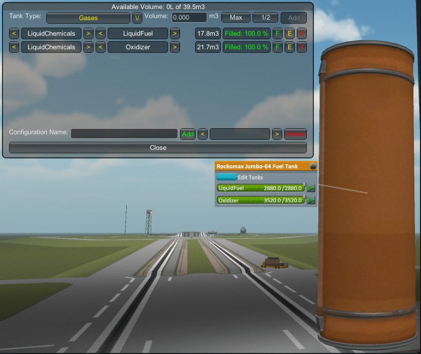

# Configurable Containers /L Unofficial

This mod converts fuel tanks and resource containers. Unofficial fork by Lisias.

## In a Hurry

* [Latest Release](https://github.com/net-lisias-kspu/ConfigurableContainers/releases)
	+ [Binaries](https://github.com/net-lisias-kspu/ConfigurableContainers/tree/Archive)
* [Source](https://github.com/net-lisias-kspu/ConfigurableContainers)
* [Project's README](https://github.com/net-lisias-kspu/ConfigurableContainers/blob/master/README.md)
* [Change Log](./CHANGE_LOG.md)
* [TODO](./TODO.md) list

## Description

This mod converts fuel tanks and resource containers so that you can change the resource(s) they hold in Editor and in Flight.

### Supported Mods
Configurable Containers support many part packs and mods:

* TweakScale
* ProceduralParts
* Parts ++with stock resources++ converted:
	+ Stock
	+ KW Rocketry
	+ Mk2 Expansion
	+ Mk3 Expansion
	+ SpaceY-Lifters
	+ SpaceY-Expanded
	+ Fuel Tanks Plus
	+ Modular Rocket Systems
	+ Standard Propulsion Systems
	+ Near Future Propulsion
	+ Spherical and Toroidal Tank Pack
	+ OPT Spaceplane Parts (made by octarine-noise)
	+ ...more will come.
* Supported resources:
	+ Stock
	+ TAC Life Support
	+ Extrapalentary Launchapads
	+ Near Future Propulsion
	+ All USI
	+ All KSPIE
	+ ...more will come.

### Types of the Containers
Tank Type is a set of resources that, gamewise, have something in common. For example gases, or liquid chemicals, or metals. There are also two kinds of configurable containers.

* **Simple** containers belong to a single Tank Type (which can be changed in Editor) and can hold only a single resource. In flight this resource may be changed only if the container is empty, and only within its Tank Type.
* **Compound** containers are in fact collections of simple containers inside of a single part. In Editor you can partition the inside space of such part, creating as many simple containers as you need. The only restriction imposed by KSP is that a part cannot have two identical resources stored. So if you have two containers for liquid chemicals in a part, only one of them can hold Liquid Fuel.

Compound containers have a dedicated user interface so as not to clutter part menu:

### For Modders

It provides the **SwitchableTank** module that allows for creation of container parts for predefined sets of resources **switchable in-flight**. Sets are configured in a separate .cfg file and are intended to contain similar things like gases (one set), liquid chemicals (another) and so on.

Another module Configurable Containers provide is the **TankManager** which enables in-editor partitioning of a container, effectively converting it into a set of independent SwitchableTanks.

The third, utility module named **SimpleTextureSwitcher** allows you to cycle through a predefined set of textures for the model or a part of the model, so a container may be easily identified.

## Installation

To install, place the GameData folder inside your Kerbal Space Program folder.

**REMOVE ANY OLD VERSIONS OF THE PRODUCT BEFORE INSTALLING**.

### Dependencies

<!-- * [KSP API Extensions/L](https://github.com/net-lisias-ksp/KSPAPIExtensions) 2.0 or later -->
* Hard Dependencies
	+ [AT Utils](https://github.com/net-lisias-kspu/AT_Utils) 

### Licensing

This work is **double** (yeah, I know. But it's safer this way!) licensed under [MIT](./LICENSE.MIT) and [SKL-1.0](./LICENSE.SKL-1_0). See [here](./LICENSE).

Choose the one that best fits your needs and are legally enforceable on your county.

Please note the copyrights and trademarks in [NOTICE](./NOTICE).

## UPSTREAM

* [allista](https://forum.kerbalspaceprogram.com/index.php?/profile/99885-allista/): Current Maintainer
	+ [Forum](https://forum.kerbalspaceprogram.com/index.php?/topic/150104-145-configurable-containers/)
	+ [SpaceDock](https://spacedock.info/mod/1002/Configurable%20Containers)
	+ [GitHub](https://github.com/allista/ConfigurableContainers/tree/master)

